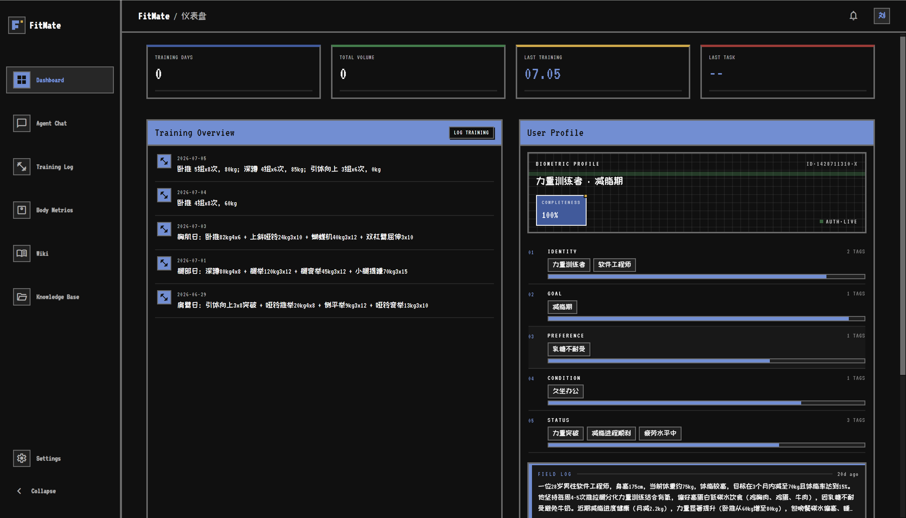
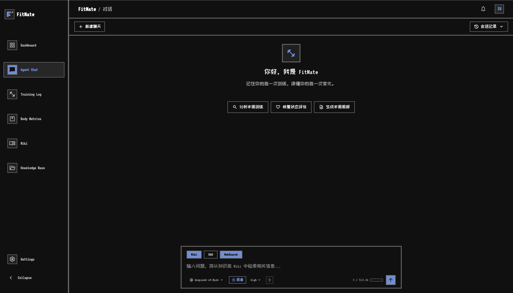
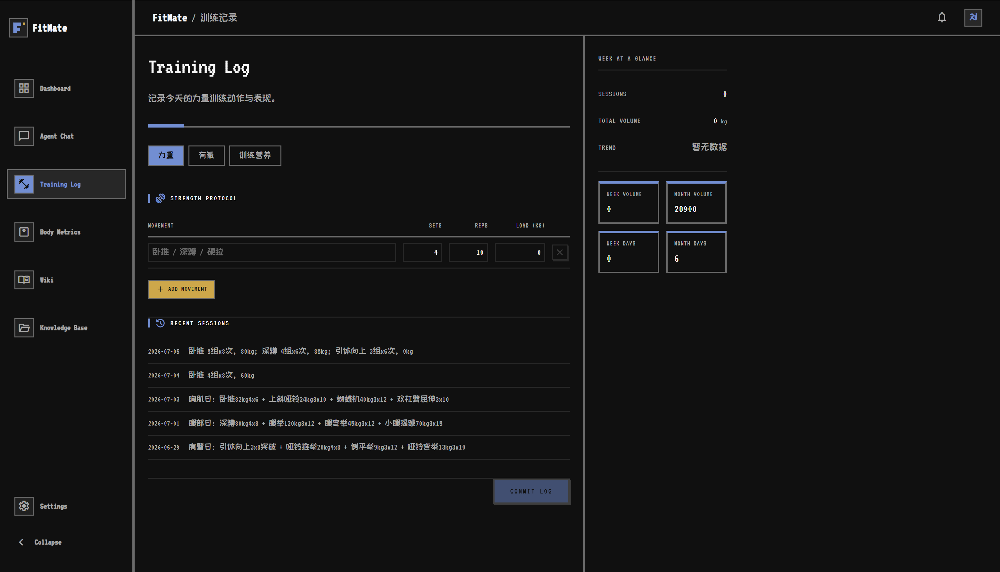
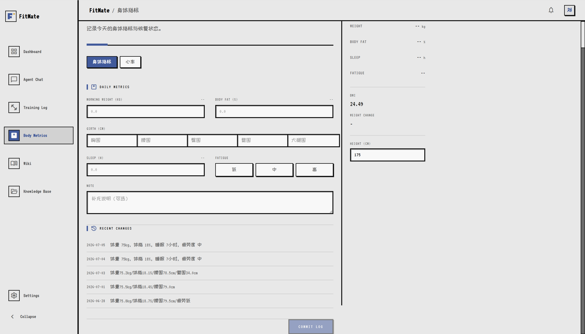
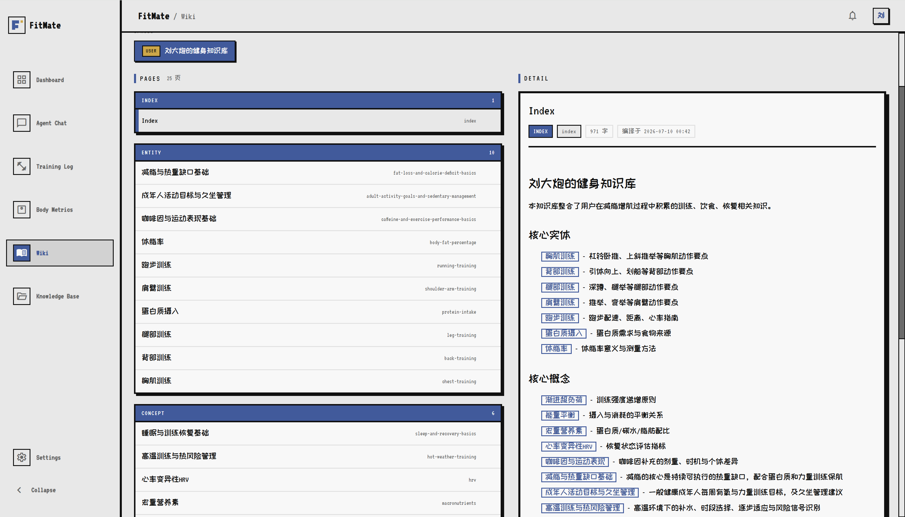
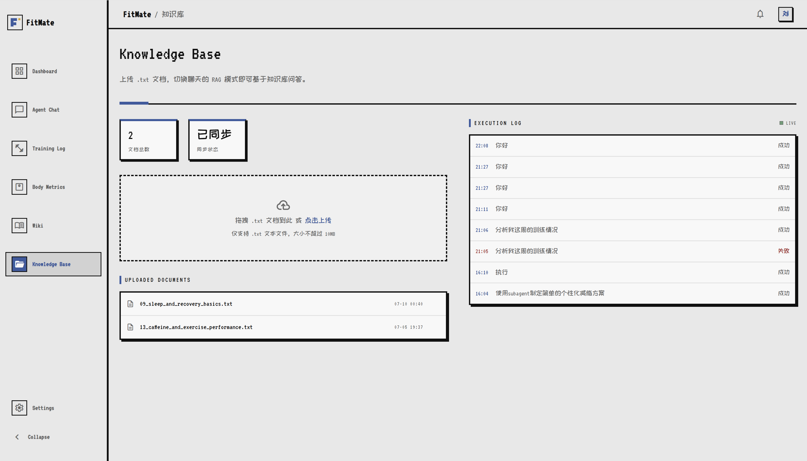
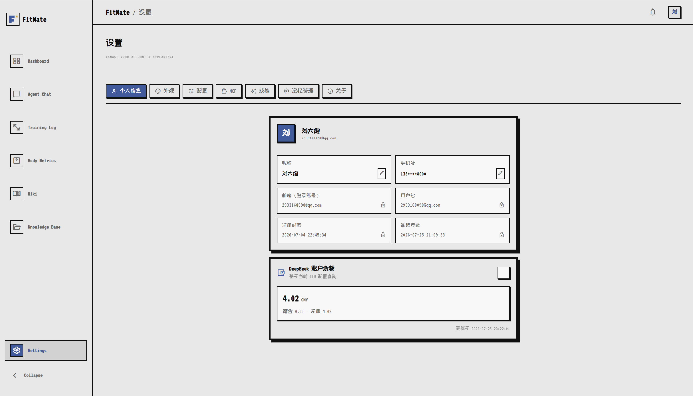
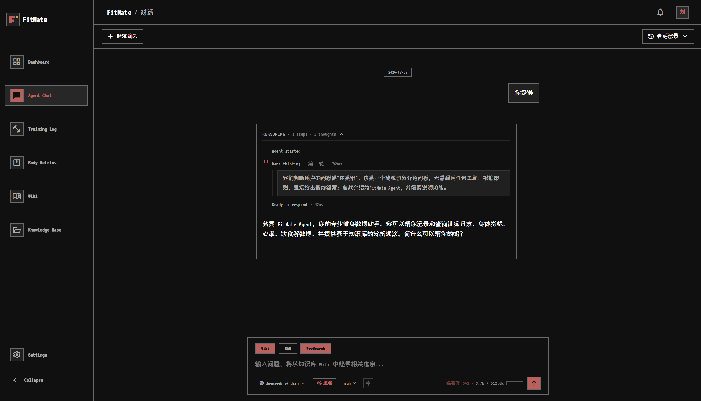
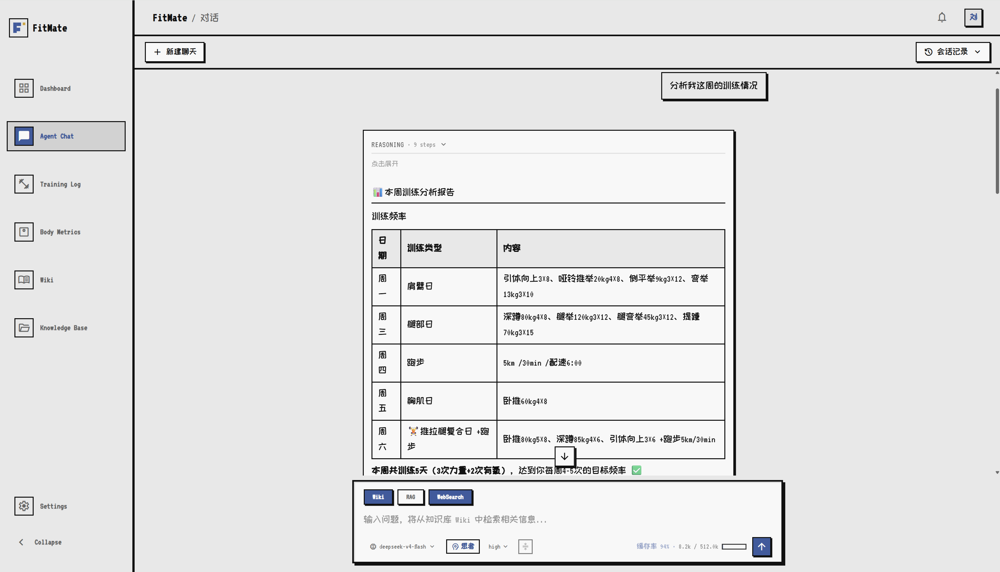
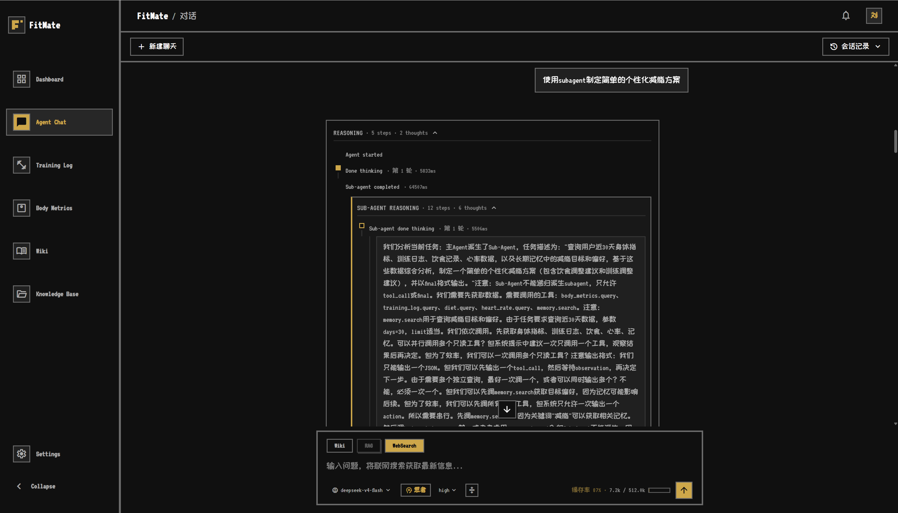

<div align="center">

# FitMate AI

[](https://openjdk.org/)
[](https://spring.io/projects/spring-boot)
[](https://vuejs.org/)
[](LICENSE)

[功能一览](#功能一览) · [快速开始](#快速开始) · [技术架构](#技术架构) · [隐私与安全](#隐私与安全)

</div>

FitMate AI 是一个面向个人健康管理的 AI 健身助手。它将训练、饮食、身体指标与个人知识库集中到同一工作流中，并通过具备工具调用、记忆和子智能体编排能力的 Agent 提供连续对话式服务。

> [!NOTE]
> 当前项目适合本地开发和自托管部署。使用大模型、邮件和第三方服务前，请自行准备对应的账号、密钥与服务。

| 对话式记录 | 个人知识库 | Agent 自动化 |
| :---: | :---: | :---: |
| 训练、饮食、身体数据 | Wiki、向量检索、RAG | 工具调用、MCP、子智能体 |

---

## 目录

- [功能一览](#功能一览)
- [技术架构](#技术架构)
- [快速开始](#快速开始)
- [配置说明](#配置说明)
- [构建与部署](#构建与部署)
- [项目结构](#项目结构)
- [测试](#测试)
- [隐私与安全](#隐私与安全)
- [许可证](#许可证)

## 功能一览

> 从日常数据记录到复杂训练计划，FitMate AI 将健康信息沉淀为可持续使用的个人上下文。

### Dashboard 用户画像

根据 Agent 的历史记忆展示用户个人信息画像。



### Chat 智能会话

支持工具调用、子智能体派发、MCP 和 Skills 按需加载，可用于日常健康咨询、数据查询和复杂任务执行。



### Training Log 训练日志

可由 LLM 从对话中提取训练记录，也支持手动记录力量、有氧与饮食数据。



### Body Metrics 身体指标

记录体重、围度、睡眠、心率等身体数据，便于长期趋势追踪。



### Wiki 与知识库

上传个人资料后，系统会进行向量化并异步编译为结构化 Wiki。检索流程为：`Wiki 预检索 -> kb.search -> rag.search（仅启用 RAG 时）`。





### 设置与模型配置

可在设置页维护个人模型配置；推荐使用 [DeepSeek 开放平台](https://platform.deepseek.com/) 提供的 OpenAI 兼容接口。



### 例如：

- 输入想了解的问题



- 点击新会话首页”分析本周训练”、”恢复状态评估”、”生成本周周报“可以加载skills执行，支持工具调用；



- 输入 “使用subagent为我制定简单的个性化减脂方案“；



## 技术架构

| 层级 | 技术选型 |
| --- | --- |
| 前端 | Vue 3、TypeScript、Vite、Vue Router、Tailwind CSS、Axios |
| 后端 | Java 21、Spring Boot 3.5、Spring AI、MyBatis-Plus |
| 数据库 | MySQL 8 |
| 缓存与向量检索 | Redis Stack / RediSearch |
| 搜索 | SearXNG |
| LLM | OpenAI 兼容 API，默认配置面向 DeepSeek |
| Embedding | BGE-M3，1024 维向量 |
| 基础设施 | Docker Compose（MySQL、Redis Stack、SearXNG） |

后端是 Maven 多模块项目：`FitMate-api` 负责主业务与 Agent，`FitMate-mcpServer` 提供 MCP 工具服务，`FitMate-common` 存放共享组件。

```text
Vue 3 Web App  <-->  Spring Boot API  <-->  Agent / Tools / MCP
                         |        |
                       MySQL    Redis Stack
                                  |
                         Vector Search / Wiki
```

### Agent 与记忆

- **ReAct 循环**：流式调用模型，解析 `tool_call`、`spawn_subagent` 与 `final` 三类动作；工具执行结果会作为 observation 回注下一轮决策。
- **流式回答展示**：使用有限状态机在模型生成 JSON 包装内容时实时提取 `final_answer`，减少最终回答的等待时间。
- **子智能体编排**：复杂任务可派生独立子 run，拥有独立的轮数、工具调用与时间预算；支持级联取消和前端嵌套追踪展示。
- **多层记忆**：包含最近消息上下文、自动压缩摘要、长期记忆（FACT、EPISODIC、INSIGHT、SNAPSHOT）和用户画像。
- **KV Cache 优化**：决策与记忆提取共享稳定的 prompt 前缀，以提升同一 run 中的缓存命中率。

### 工具、MCP 与知识库

- 内置训练、饮食、心率、身体指标、长期记忆、Wiki、RAG、联网搜索、网页抓取和 Skills 加载等工具。
- 工具实现统一的 `ToolExecutor` 接口，由 Spring 自动注册，并可与用户 MCP 工具动态合并。
- Wiki 由 LLM 从用户对话生成；结合向量、关键词混合检索与重排序，在 Agent 执行前提供预检索上下文。

### 并发与可观测性

- 单个登录会话支持最多 3 个并发 Agent 任务，使用独立 Redis 锁槽与续期机制。
- 支持协作式取消：停止主任务时会级联取消子任务，并保留已经生成的内容。
- 前端提供推理时间线、工具步骤卡片、子 Agent 折叠追踪和全局运行任务面板。

## 快速开始

> [!TIP]
> 建议先完成基础依赖、LLM 与 embedding 服务配置，再依次启动 MCP、API 和前端。这样可以更快定位连接问题。

### 1. 准备环境

- JDK 21
- Maven 3.9+
- Node.js 20+ 与 npm
- Docker 与 Docker Compose
- 一个 OpenAI 兼容的 LLM API 密钥
- 一个可用的 BGE-M3 embedding HTTP 服务

启动本地依赖服务：

```bash
docker compose up -d
```

这会启动 MySQL、Redis Stack 与 SearXNG，并将端口绑定到本机回环地址。首次启动时会执行 `FitMate-backend/FitMate-mcpServer/src/main/resources/sql/fitmate_init.sql` 初始化数据库。

### 2. 配置服务

根据生产模板创建本地配置，不要将实际配置提交到 Git：

```bash
copy FitMate-backend\FitMate-api\src\main\resources\application-prod.yml.example FitMate-backend\FitMate-api\src\main\resources\application-prod.yml
copy FitMate-backend\FitMate-mcpServer\src\main\resources\application-prod.yml.example FitMate-backend\FitMate-mcpServer\src\main\resources\application-prod.yml
```

Linux 或 macOS 请使用 `cp` 替代 `copy`。开发环境也可通过环境变量提供配置。至少需要配置数据库、Redis、`OPENAI_API_KEY`、`OPENAI_BASE_URL`、`OPENAI_MODEL` 与 `EMBEDDING_SERVICE_URL`。

> 使用根目录 Docker Compose 时，数据库对宿主机暴露在 `5506` 端口。API 开发配置默认使用该端口；MCP 服务默认使用 `3306`，本地运行时请设置 `DB_PORT=5506`。

### 3. 启动后端

在两个终端中分别运行：

```bash
cd FitMate-backend
mvn -pl FitMate-mcpServer -am spring-boot:run
```

```bash
cd FitMate-backend
mvn -pl FitMate-api -am spring-boot:run
```

默认端口：API 为 `7070`，MCP 服务为 `9070`。API 会连接 MCP SSE 服务；请先确保 MCP 服务可用。

### 4. 启动前端

```bash
cd FitMate-frontend
npm install
npm run dev
```

开发服务器运行在 `http://127.0.0.1:5500`，本地请求会直连 `http://127.0.0.1:7070`。

首次进入系统后，使用邮箱验证码注册或已有账号登录；然后在设置页填入自己的模型配置，即可开始对话、记录训练数据或加载 Skills。

## 配置说明

| 类别 | 关键项 | 说明 |
| --- | --- | --- |
| 数据库 | `DB_HOST`、`DB_PORT`、`DB_NAME`、`DB_USERNAME`、`DB_PASSWORD` | MySQL 连接信息 |
| Redis | `REDIS_HOST`、`REDIS_PORT`、`REDIS_PASSWORD` | Redis Stack / RediSearch 连接信息 |
| LLM | `OPENAI_API_KEY`、`OPENAI_BASE_URL`、`OPENAI_MODEL` | OpenAI 兼容模型服务 |
| Embedding | `EMBEDDING_SERVICE_URL` | BGE-M3 向量化服务地址 |
| MCP | `MCP_SERVER_URL`、`MCP_SERVER_PORT` | MCP SSE 服务地址与端口 |
| 搜索 | `SEARXNG_SEARCH_URL` | 可选，SearXNG 搜索接口 |
| 邮件 | SMTP 相关环境变量 | 用于邮箱验证码能力 |

API 主程序会尝试读取项目根目录的 `.env` 文件并映射为系统属性。无论使用 `.env`、环境变量还是 `application-prod.yml`，都应仅在本地或受控部署环境保存真实凭据。

> [!IMPORTANT]
> 配置示例只说明变量名称，不应将真实 API Key、数据库密码、邮件密码或用户健康数据写入 README、日志和提交记录。

## 构建与部署

### 前端构建

```bash
cd FitMate-frontend
npm install
npm run build
```

Vite 会直接将构建产物写入 `FitMate-backend/FitMate-api/src/main/resources/static`。生产环境下，前端会使用同源 API 地址；请通过反向代理将 API 请求转发到后端服务。

### 后端打包

```bash
cd FitMate-backend
mvn clean package -DskipTests
```

将实际生产配置保存在服务器环境变量或被忽略的 `application-prod.yml` 中，再启动对应的可执行 JAR。数据库初始化 SQL 支持按阶段执行；对已升级的数据库重复执行前请先审阅其中的迁移语句。

---

## 项目结构

```text
.
├── FitMate-frontend/                 # Vue 3 前端
│   ├── src/                          # 页面、组件、服务与运行时配置
│   └── vite.config.ts                # 构建配置，输出到后端静态目录
├── FitMate-backend/
│   ├── FitMate-api/                  # 主业务、Agent、RAG 与静态资源
│   ├── FitMate-mcpServer/            # MCP 工具服务与数据库初始化脚本
│   ├── FitMate-common/               # 共享组件
│   └── SPEC.md                       # 后端工程约定
├── docker-compose.yml                # 本地 MySQL、Redis Stack、SearXNG
├── 部署过程.md                        # 部署记录与说明
└── SPEC.md                           # 全局工程约定
```

## 测试

后端测试可在 Maven 根目录执行：

```bash
cd FitMate-backend
mvn test
mvn -pl FitMate-api -am test
mvn -pl FitMate-mcpServer -am test
```

前端当前提供 `dev`、`build` 和 `preview` 脚本；尚未定义统一的 `test`、`lint` 或 `type-check` npm 脚本。

## 隐私与安全

- 不要提交 `.env`、`application-prod.yml`、密钥文件、云隧道配置或真实账号信息。仓库的 `.gitignore` 已覆盖这些常见文件，但提交前仍应复查 `git status`。
- 使用自己的模型密钥时，请优先在设置页、环境变量或受控配置文件中保存，避免在 Issue、截图、日志或 README 中泄露。
- 部署时请为 MySQL、Redis、SMTP 和模型服务设置强凭据，并限制数据库和缓存端口的外部访问。
- 健康数据具有敏感性。自托管前请评估数据存储位置、访问控制、日志保留策略及适用的隐私法规。

> [!WARNING]
> 如果仓库会公开，请在每次推送前检查 `git status` 和暂存区，确认其中没有运行时配置、导出的数据库文件、截图中的账号信息或任何真实凭据。

## 许可证

本项目采用 [MIT License](LICENSE)。
